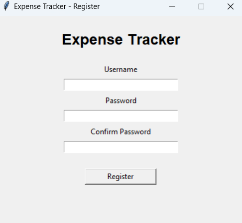

# 💰 Expense Tracker

A Python-based Expense Tracker application built with Tkinter and SQLite to help users manage their income and expenses through a simple and user-friendly desktop interface.

---

## ✨ Features

- 🔐 Secure User Login and Registration
- 💵 Add Income and Expense Transactions
- ✏️ Edit Existing Transactions
- 🗑️ Delete Transactions
- 📋 View Transaction History
- 💾 SQLite Database for Data Storage
- 🖥️ User-Friendly Tkinter GUI

---

## 🛠️ Technologies Used

### Languages & Frameworks
- Python
- Tkinter
- SQLite
- SQL

### Tools
- Visual Studio Code
- GitHub
  
---

## 📂 Project Structure

```
expense-tracker/
│
├── screenshots/
├── main.py
├── login.py
├── register.py
├── database.py
├── requirements.txt
├── .gitignore
└── README.md
```

---

## 📸 Screenshots

### Login Page


---

### Registration Page



---

### Dashboard


---

### Add Transaction


---

### Transaction History


---

## 🔮 Future Enhancements

- Expense Reports
- Charts and Graphs
- Export to Excel/PDF
- Monthly Budget Tracking
- Dark Mode

---

## 👩‍💻 Author

**Madana Kusuma Mani Deepthi**

GitHub: [@deepthi8143](https://github.com/deepthi8143)

---

⭐ If you found this project helpful, consider giving it a star!
